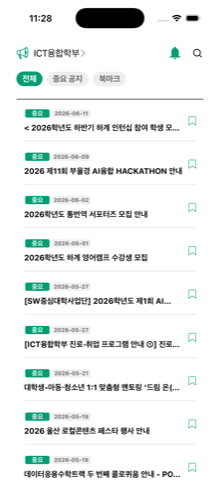
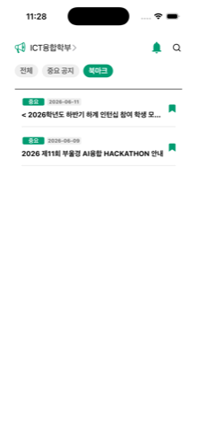
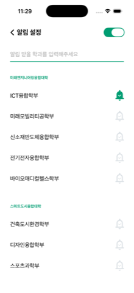
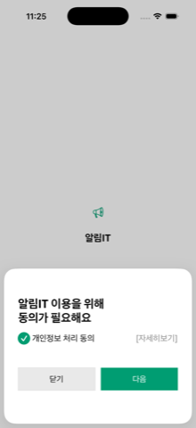
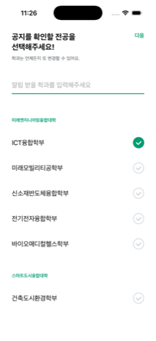
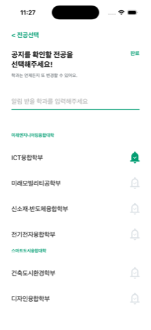

<div align="center">

# 알림IT

**울산대학교 학과 공지를 한곳에서 확인하는 iOS 앱**

Flutter로 만들어져 있던 앱을 SwiftUI로 다시 쓴 버전입니다.

<sub>Swift 5 · SwiftUI · iOS 16+ · Firebase Cloud Messaging</sub>

</div>

<br>

<div align="center">
  
  
  
</div>

<div align="center">
  <sub>공지 목록 &nbsp;·&nbsp; 북마크 &nbsp;·&nbsp; 알림 설정</sub>
</div>

<br>

## 무엇을 하는 앱인가

학과 홈페이지를 일일이 들어가지 않아도 공지를 모아서 보여줍니다.

- 전공별 공지 목록, 무한 스크롤
- 중요 공지 / 북마크 필터, 키워드 검색
- 관심 학과를 구독해두면 새 공지를 푸시로 받음
- 공지를 누르면 앱 안에서 원문 열람, 사파리로 넘기기도 가능

<br>

<div align="center">
  
  
  
</div>

<div align="center">
  <sub>처음 실행하면 동의 → 전공 선택 → 알림 받을 학과 순으로 진행됩니다</sub>
</div>

<br>

## 실행하기

`pod install`까지 끝난 상태로 들어있어서 워크스페이스만 열면 됩니다.

```bash
open NotificationIT.xcworkspace
```

커맨드라인에서 빌드하려면:

```bash
xcodebuild -workspace NotificationIT.xcworkspace -scheme NotificationIT -destination 'generic/platform=iOS Simulator' build
```

프로젝트 파일을 지우고 처음부터 만드는 경우에는 `project.yml`과 `Podfile`이 있으니 아래 순서로 하면 됩니다.

```bash
xcodegen generate
```

```bash
LANG=en_US.UTF-8 pod install
```

> `pod install` 앞의 `LANG`은 빼면 안 됩니다. 에셋 파일명이 한글이라 로케일이 UTF-8이 아니면 CocoaPods가 인코딩 에러로 죽습니다.

실기기에 올릴 때는 Signing & Capabilities에서 Push Notifications와 Background Modes(Remote notifications)를 켜야 합니다. 번들 ID는 `com.uou.alarmit`.

<br>

## 구조

```
NotificationIT/
├── NotificationITApp.swift     앱 진입점
├── AppDelegate.swift           Firebase, APNs 등록
├── AppRouter.swift             스플래시 → 온보딩 → 메인 화면 전환
│
├── SplashScreen.swift          버전 체크, 강제 업데이트
├── IntroPage.swift             동의 여부에 따른 분기
├── ConsentManager.swift        개인정보 동의 + 바텀시트
├── init_selecet_page.swift     전공 선택 (대표 전공 / 알림 받을 전공)
├── mainPage.swift              공지 목록, 검색, 필터, 페이징
├── list_elements.swift         공지 셀
├── majorCategory.swift         전공 변경
├── alram.swift                 알림 설정
├── webView.swift               공지 원문 (WKWebView)
│
├── ApiService.swift            REST 호출 + Notice 모델
├── BookmarkManager.swift       북마크 저장
├── NotificationService.swift   로컬 알림, 권한, 디바이스 ID
├── FcmMessaging.swift          FCM 토큰 / APNs 토큰
└── Helpers.swift               색상, SVG 에셋, URL 열기
```

화면 이동은 `AppRouter`가 담당합니다. Flutter의 `Navigator.pushReplacement`처럼 루트를 통째로 갈아끼우는 흐름이라 `NavigationStack`만으로는 표현이 안 돼서 따로 뒀습니다.

<br>

## Flutter에서 넘어온 것들

| 쓰던 것 | 바뀐 것 |
|---|---|
| `shared_preferences` | `UserDefaults` |
| `http` | `URLSession` |
| `webview_flutter` | `WKWebView` |
| `url_launcher` | `UIApplication.open` |
| `flutter_local_notifications` | `UNUserNotificationCenter` |
| `firebase_messaging` | `FirebaseMessaging` |
| `device_info_plus` | `UIDevice.identifierForVendor` |
| `package_info_plus` | `Bundle.main` |
| `flutter_svg` | 에셋 카탈로그 (벡터 보존) |

SVG 아이콘 28개는 `Assets.xcassets`에 벡터로 넣어서 `Image(_:)`로 씁니다.

<br>

## 알아두면 좋은 것

**서버 파라미터** — 공지 목록은 `type` 값으로 필터링됩니다. `전체`는 전부, `공지`는 중요 공지만 옵니다. 원본에서 첫 페이지와 다음 페이지가 서로 다른 값(`공지` / `중요 공지`)을 보내고 있었는데, 후자는 서버가 인식하지 못해서 필독 공지가 섞여 들어왔습니다. 지금은 `공지`로 통일돼 있습니다.

**URL 인코딩** — 쿼리에 한글이 들어가지만 따로 인코딩하면 안 됩니다. `URL(string:)`이 알아서 처리하는데, 미리 퍼센트 인코딩하면 `%`가 다시 인코딩되면서 깨집니다.

**첫 실행 화면 다시 보기** — 시뮬레이터는 앱을 지워도 `cfprefsd`가 `UserDefaults`를 캐싱하고 있어서 온보딩이 다시 안 나옵니다. 확실한 방법은 기기 초기화입니다.

```bash
xcrun simctl shutdown all && xcrun simctl erase all
```

**스플래시 이미지** — 원본 코드가 `알림it_splash_image.svg`를 참조하는데 실제 파일명은 `알림it_splash_icon.svg`입니다. 원본 동작을 유지하려고 참조를 그대로 뒀기 때문에 스플래시에 이미지가 뜨지 않습니다.

**미사용 코드** — `GET_notice.swift`, `keyword.swift`, `mainPage.swift`의 `showPrivacyConsentBottomSheet`는 원본에도 있지만 아무도 호출하지 않습니다. 변환 시 함께 옮겨두었습니다.
